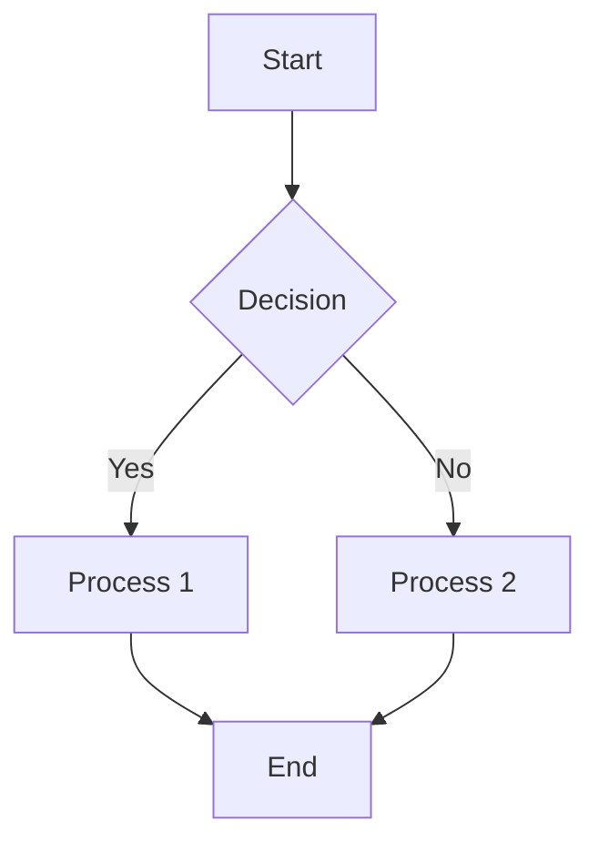
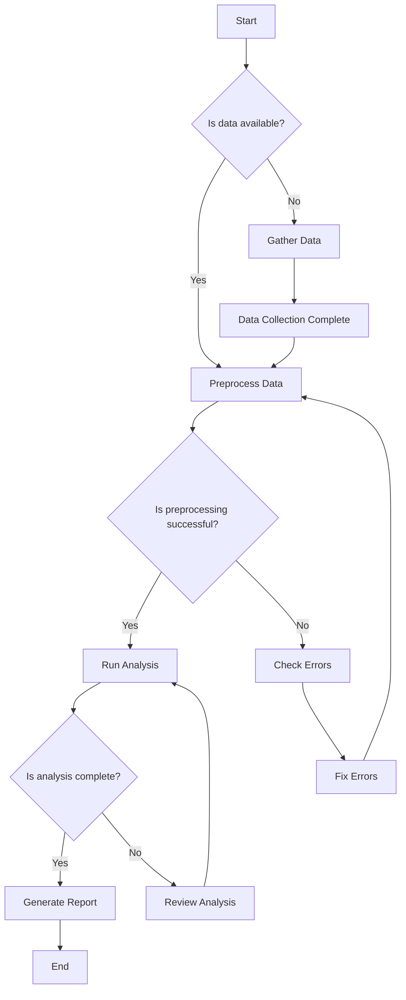

# FlowChartStudy

This is a sample of a GitHub flow chart inside the README.md.

# Help 

https://docs.github.com/en/get-started/writing-on-github/working-with-advanced-formatting/creating-diagrams

## Method:1

## notes

A, B, C, and D represent nodes

## Method:1

