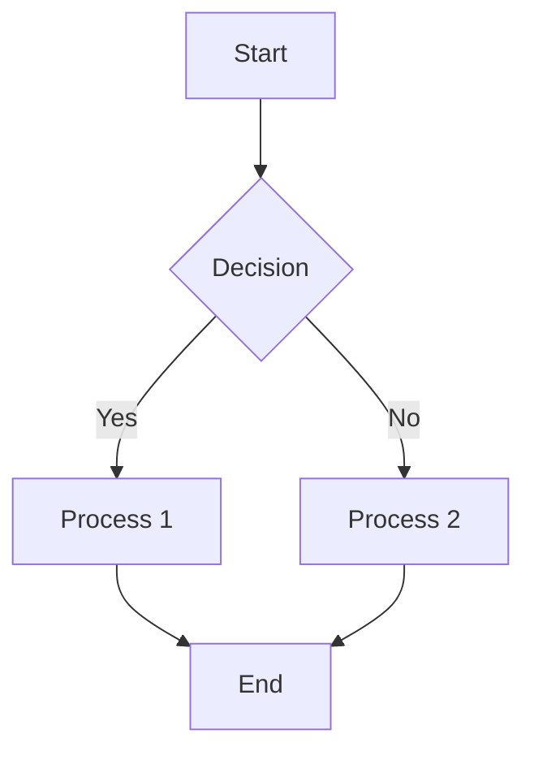
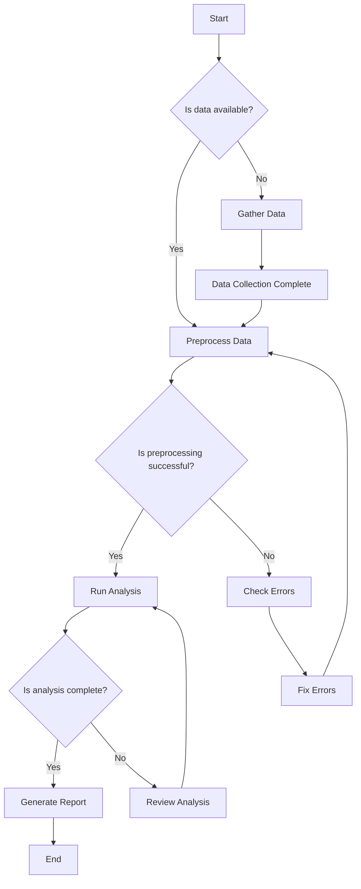
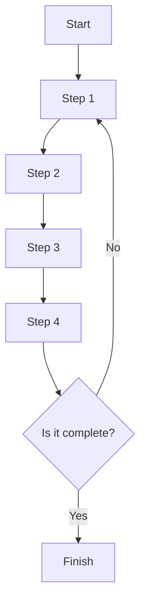
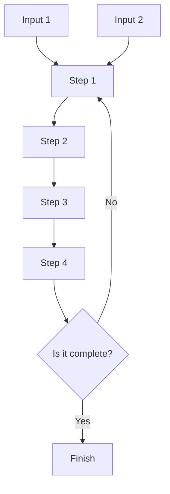
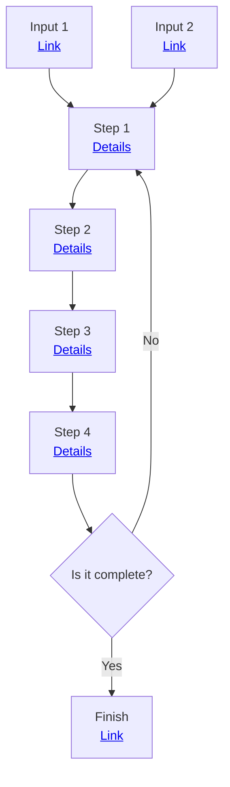
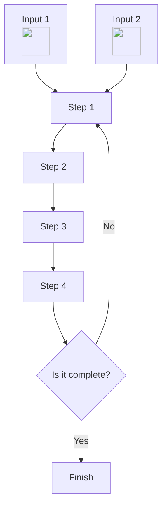
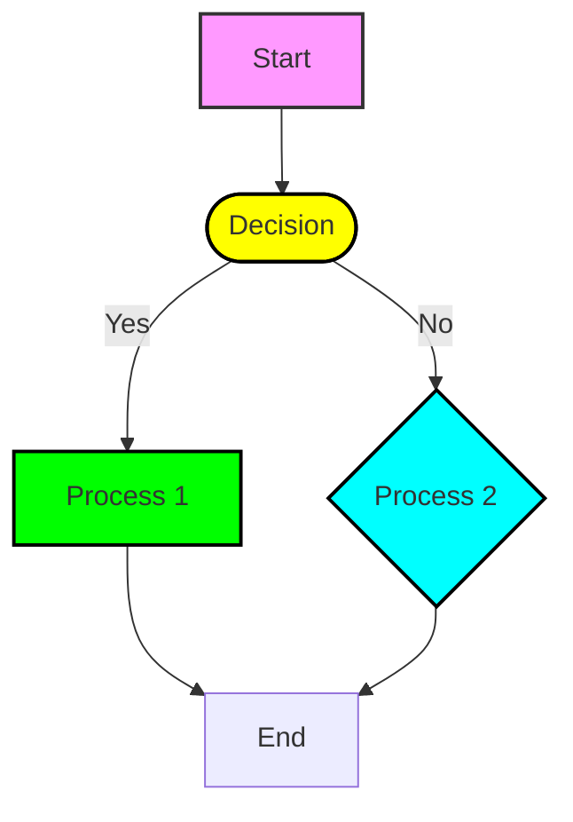
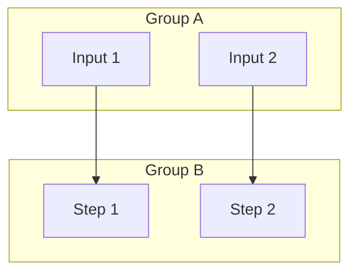
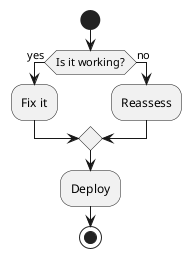

# FlowChartStudy

This is a sample of a GitHub flow chart inside the README.md.


# Help 

https://docs.github.com/en/get-started/writing-on-github/working-with-advanced-formatting/creating-diagrams


## Method:1




## notes

A, B, C, and D represent nodes


## Method:2




## Method:3




## Method:4 (TWO input)





## Method:5 (URL)



## Method:6 (Image) # not work



### Explanation of Shapes

- **Rectangles**: Default shape for regular nodes.
- **Circles**: Use parentheses `()` to create circular nodes.
- **Diamonds**: Use curly braces `{}` to create diamond shapes for decisions.


## Method:8 (Custom Shape Flowchart)




## Method:9 (subgraph)




## Method:10 (plantuml)


### http://www.plantuml.com/plantuml/uml/SyfFKj2rKt3CoKnELR1Io4ZDoSa70000

```
PlantUML is an open-source tool that allows you to create diagrams from plain text descriptions. 
It uses a simple and intuitive language to define diagrams, making it easy to integrate with various documentation tools and systems.
```





